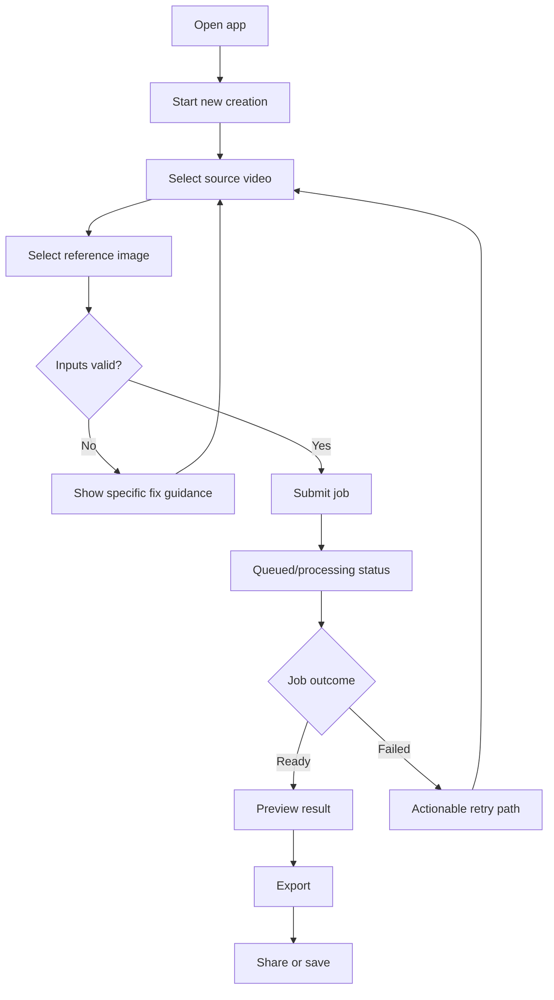
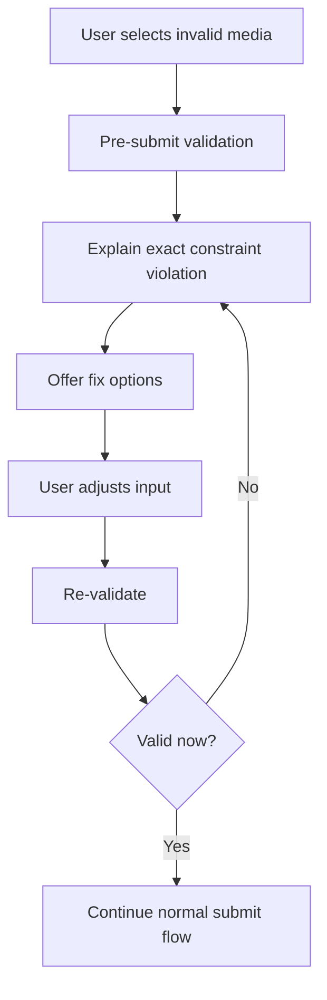

# UX Design Specification banyone

**Author:** Nam
**Date:** 2026-03-23

---

<!-- UX design content will be appended sequentially through collaborative workflow steps -->

## Executive Summary

### Project Vision

banyone is a mobile-first AI creation app that lets users replace the character in a source video using a reference image while preserving original motion and scene continuity. The UX vision is to make a technically complex transformation feel simple, trustworthy, and repeatable through a minimal-step flow, transparent job progress, and predictable recovery when constraints or failures occur.

### Target Users

The primary audience is casual and aspiring creators who want believable character-replacement results without pro editing workflows or AI prompting expertise. They are typically mainstream mobile users who value speed, clarity, and low friction over advanced controls. Secondary users include moderation and support operators who require clear diagnostics and policy-safe handling tools to keep the platform reliable and compliant.

### Key Design Challenges

The core challenge is reducing cognitive load in a high-latency AI workflow while maintaining user trust. Users must understand input limits before submission, receive unambiguous status and error feedback during asynchronous processing, and recover quickly from failed or invalid jobs. The design must also balance "good enough" output quality with cost-aware constraints without making users feel restricted.

### Design Opportunities

A best-in-class first-run experience can become a key differentiator by helping users reach a successful export quickly with minimal decisions. Clear validation, retry pathways, and status transparency can turn inevitable technical constraints into confidence-building moments. Thoughtful trust and disclosure UX can strengthen brand credibility and app-store readiness while preserving a lightweight, creator-friendly experience.

## Core User Experience

### Defining Experience

The core experience is "upload one video and one reference image, then confidently reach a shareable swapped output without confusion." The interaction must feel guided and deterministic: users always know what step they are in, what is happening during processing, and what to do next.

### Platform Strategy

The primary platform strategy is mobile-first (`iOS` and `Android`) with touch-first interaction patterns. The UX favors one-handed usage, short-session completion, resumable progress, and robust state restoration after app backgrounding or network interruptions.

### Effortless Interactions

- Input selection and validation should feel immediate, with inline guidance before submission.
- Job submission should provide instant acknowledgment and clear queue status.
- Preview and export should be one-tap actions after completion.
- Recovery should be lightweight: users get exact fixes, not generic failure messages.

### Critical Success Moments

- First successful preview where motion and scene continuity appear believable.
- First export and share completed without support.
- First recovery from a failed/invalid input where user quickly succeeds on retry.

### Experience Principles

- Clarity over cleverness for every step in the generation flow.
- Progressive disclosure: simple defaults first, advanced choices later.
- Transparent system status for all asynchronous operations.
- Fast recovery and preserved user progress under failure conditions.

## Desired Emotional Response

### Primary Emotional Goals

Users should feel confident, creatively empowered, and pleasantly surprised by output quality relative to effort. The product should replace "AI uncertainty" with a clear sense of control and trust.

### Emotional Journey Mapping

- Discovery: "This looks easy enough to try now."
- Setup and submit: "I understand exactly what is required."
- Processing: "The app is in control and keeps me informed."
- Preview/export: "This worked better than expected."
- Return use: "I can get results quickly whenever I need them."

### Micro-Emotions

- Confidence over confusion through explicit constraints and visible progress.
- Trust over skepticism through deterministic feedback and policy transparency.
- Excitement over anxiety via clear expected outcomes and progress milestones.
- Accomplishment over frustration through quick retries and successful exports.

### Design Implications

- Confidence -> strong step guidance, immediate validation, clear completion states.
- Trust -> status fidelity, understandable failures, transparent policy messaging.
- Delight -> preview-first moments, subtle celebration after successful export.
- Calm -> minimal decision load, stable defaults, no hidden states.

### Emotional Design Principles

- Predictability builds trust in AI workflows.
- Feedback quality is as important as output quality.
- "First success fast" is the emotional anchor for retention.

## UX Pattern Analysis & Inspiration

### Inspiring Products Analysis

- `CapCut`: streamlined media workflows, clear action hierarchy, quick results.
- `Instagram`: familiar sharing primitives and high polish in core actions.
- `TikTok`: low-friction creation loop with immediate user feedback.

These products show that fast onboarding, clear affordances, and visible progress signals are essential for mainstream creative users.

### Transferable UX Patterns

- Guided, linear task flow for first-time completion.
- Strong CTA hierarchy with one dominant next action per screen.
- Inline education at point-of-need instead of long tutorials.
- Persistent status surfaces for long-running operations.
- Lightweight post-success actions (save/share/reuse) to reinforce value.

### Anti-Patterns to Avoid

- Overloaded screens with too many configuration options upfront.
- Ambiguous processing states ("working..." with no progress context).
- Generic error messages that do not provide next steps.
- Deep navigation structures for a workflow that should be short and direct.

### Design Inspiration Strategy

- Adopt: quick-start flow patterns and feedback visibility from mainstream creator apps.
- Adapt: media creation patterns to asynchronous AI job lifecycle constraints.
- Avoid: pro-editor complexity and hidden state transitions that break trust.

## Design System Foundation

### 1.1 Design System Choice

Use a themeable system with mobile-ready primitives and accessibility defaults (for example, Material-inspired components with customized tokens and interaction behaviors).

### Rationale for Selection

- Balances speed-to-build with brand-level customization.
- Provides mature component and accessibility foundations for mobile UX.
- Reduces design and implementation risk for a lean team.

### Implementation Approach

- Start with system primitives for buttons, forms, sheets, and navigation.
- Layer product-specific tokens (color, type, spacing, radius, elevation).
- Build workflow-specific components on top of shared primitives.

### Customization Strategy

- Keep component APIs predictable and consistent.
- Limit visual divergence to brand tokens and key interaction moments.
- Document interaction rules for async states, errors, and retry patterns.

## 2. Core User Experience

### 2.1 Defining Experience

The defining interaction is a "two-input-to-one-output" creation loop with transparent progress: select source video, select reference image, submit, track, preview, export/share.

### 2.2 User Mental Model

Users expect a simple creator app flow (pick media -> process -> result). They do not expect to manage model parameters. Their mental model is outcome-first, so the product should hide technical complexity and expose only actionable choices.

### 2.3 Success Criteria

- Users can complete first export in one session without external help.
- Users always understand current state and next action.
- Users recover from invalid input or failed jobs without restarting from zero.

### 2.4 Novel UX Patterns

The product combines familiar media-upload patterns with AI-job lifecycle transparency. Novelty exists in how progress, quality constraints, and retries are presented as understandable, user-centered steps.

### 2.5 Experience Mechanics

1. Initiation: clear "Create" entry point and two required inputs.
2. Interaction: guided selection, validation, and submit confirmation.
3. Feedback: live state updates (queued, processing, ready, failed) and ETA bands.
4. Completion: preview gate, export/share action, and optional "create another" loop.

## Visual Design Foundation

### Color System

Use a high-contrast, creator-friendly palette with strong semantic mapping:
- Primary: action and progress anchors.
- Secondary: supportive surfaces and metadata.
- Success/warning/error/info: explicit status communication.
- Neutral scales: hierarchy, borders, backgrounds, disabled states.

All semantic colors should meet at least WCAG AA contrast targets.

### Typography System

Use a modern, highly legible sans-serif family with clear hierarchy:
- Heading scale for task context and status.
- Body scale optimized for mobile reading.
- Labels/captions for metadata and helper text.

Line-height and weight choices prioritize clarity in dense mobile workflows.

### Spacing & Layout Foundation

Adopt an 8px base spacing system with touch-safe density:
- Compact enough for workflow efficiency.
- Spacious enough for scanability and confidence.
- Consistent section rhythm across forms, status cards, and actions.

### Accessibility Considerations

- Minimum touch target size of 44x44px.
- Strong focus visibility for keyboard/accessibility navigation paths.
- Non-color status cues (icons/text) alongside color coding.
- Dynamic text resilience for larger font settings.

## Design Direction Decision

### Design Directions Explored

Design directions were evaluated across density, emphasis, and navigation style:
- Direction A: minimal, high clarity, conservative visual weight.
- Direction B: expressive, creator-forward visuals, richer emphasis.
- Direction C: balanced operational clarity and polished brand presence.

### Chosen Direction

Choose a balanced direction (C): clear workflow structure with selective expressive accents around success and preview moments.

### Design Rationale

- Preserves usability and trust during long-running operations.
- Supports emotional goals (confidence + delight) without distraction.
- Scales from MVP to richer future feature sets.

### Implementation Approach

- Build base screens with high clarity and consistent hierarchy.
- Apply branded accents to key milestones (ready/success/share).
- Keep motion subtle and purposeful for status transitions.

## User Journey Flows

### Casual Creator - First Success Flow

Primary path from install to first export.

### Edge Case - Constraint Recovery Flow

Flow for duration/format/reliability failures.

### Journey Patterns

- Single dominant action per screen.
- Visible progress and state continuity across app lifecycle events.
- Recovery-first messaging that preserves user effort.

### Flow Optimization Principles

- Minimize time-to-first-preview.
- Keep decision points explicit and low-cognitive-load.
- Ensure every failure state has a direct recovery action.

## Component Strategy

### Design System Components

Use standard components for core structure: text fields, buttons, chips, tabs, cards, bottom sheets, snackbars, dialogs, progress indicators, and navigation surfaces.

### Custom Components

1. Job Status Timeline Card
- Purpose: make async progress legible and trustworthy.
- States: queued, processing, ready, failed, retriable.
- Accessibility: screen-reader-friendly state announcements.

2. Input Compliance Checker
- Purpose: validate media constraints pre-submit.
- States: pending, valid, invalid-with-fix.
- Accessibility: explicit error text tied to field controls.

3. Preview Compare Surface
- Purpose: present generated result with context and clear export action.
- States: loading, ready, failed-preview.
- Accessibility: labeled controls and alternate text cues.

### Component Implementation Strategy

- Compose custom components from shared primitives and tokens.
- Standardize status, error, and empty states across all workflow surfaces.
- Enforce accessibility as part of component acceptance criteria.

### Implementation Roadmap

- Phase 1: compliance checker, status timeline, primary creation flow components.
- Phase 2: preview comparison and improved retry/diagnostic surfaces.
- Phase 3: enhancement components for retention and premium controls.

## UX Consistency Patterns

### Button Hierarchy

- Primary button: one key action per screen.
- Secondary button: supportive alternatives.
- Tertiary/text actions: low-priority utilities.
- Destructive actions require confirmation and explicit labeling.

### Feedback Patterns

- Success: concise confirmation + next best action.
- Error: plain-language cause + fix path.
- Warning: proactive guidance before costly failure.
- Info: contextual explanation without blocking flow.

### Form Patterns

- Validate as early as possible with inline guidance.
- Group related inputs and preserve draft state automatically.
- Use clear required/optional indicators and accessible labels.

### Navigation Patterns

- Mobile-first bottom navigation for persistent destinations.
- Linear, step-based progression inside creation flow.
- Back navigation preserves progress and context.

### Additional Patterns

- Loading: explicit stage labels, not indefinite spinners alone.
- Empty states: explain value and provide a clear first action.
- Modals/sheets: limited scope actions with obvious dismissal controls.

## Responsive Design & Accessibility

### Responsive Strategy

Design mobile-first for phones, then scale to tablet with improved information density and side-by-side preview/status where useful. Desktop parity is optional and can be added as an operations/support extension later.

### Breakpoint Strategy

- Mobile: 320-767
- Tablet: 768-1023
- Desktop: 1024+

Use content-driven adjustments, prioritizing touch ergonomics and readable status communication.

### Accessibility Strategy

Target WCAG 2.2 AA for all end-user and operations-critical experiences.

Key requirements:
- semantic structure and proper control labeling
- keyboard/switch and screen-reader compatibility
- sufficient contrast and non-color feedback cues
- touch-safe target sizing and focus indicators

### Testing Strategy

- Real-device checks for iOS and Android baseline devices.
- Automated accessibility scans integrated in CI where possible.
- Manual screen-reader and keyboard navigation verification for core flows.
- Failure-path testing for validation, retries, and connectivity interruptions.

### Implementation Guidelines

- Build with semantic components and explicit accessibility props.
- Use relative sizing and responsive layout primitives.
- Keep state transitions deterministic and announced.
- Treat accessibility regressions as release blockers for core flow surfaces.
